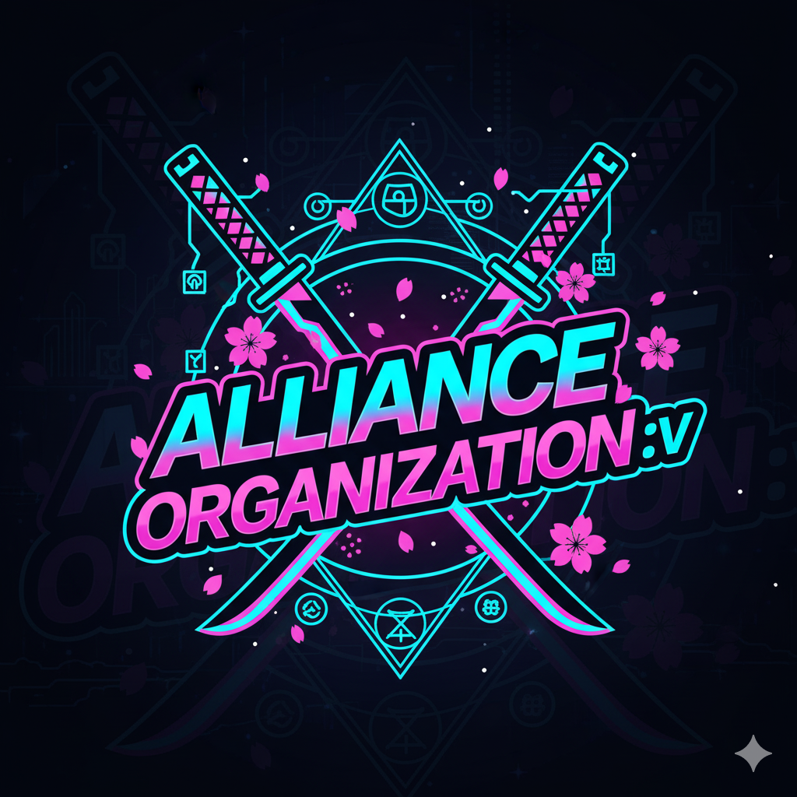

<div align="center">
  
  <br/>
  <h1>Message App</h1>
  <p><strong>A cross-platform, real-time group chat application built with Flutter and Supabase.</strong></p>
  <p>Created by <strong>Oceanami</strong></p>
</div>

<!-- Badges -->
<div align="center">
  <!-- Platforms -->
  
  <!-- Flutter Version -->
  
  <!-- License -->
  
  <!-- Supabase -->
  
</div>

<br/>

> **MessageApp** is a single-room group chat application designed for teams, families, or any group that needs a shared communication space. All authenticated users join a single, common chatroom with a full suite of modern messaging features.

## 🖼️ Application Interface

<div align="center">
  <table>
    <tr>
      <td valign="top"></td>
      <td valign="top"></td>
      <td valign="top"></td>
      <td valign="top"></td>
    </tr>
    <tr>
      <td align="center"><i>Onboarding Screen</i></td>
      <td align="center"><i>Main Chat Interface</i></td>
      <td align="center"><i>Chat Features</i></td>
      <td align="center"><i>User Profile</i></td>
    </tr>
  </table>
</div>

## ✨ Key Features

| Feature Group           |   Icon   | Details                                                     |
| :---------------------- | :------: | :---------------------------------------------------------- |
| **Real-time Messaging** |    ⚡    | Instantly send and receive messages with Supabase Realtime. |
| **User Authentication** |    🔐    | Sign in with Email/Password via Supabase Auth.              |
| **Text Messages**       |    📝    | Compose and send unlimited text messages.                   |
| **Image Sharing**       |    🖼️    | Pick images from the gallery, with automatic compression.   |
| **Voice Messages**      |    🎤    | Record and send voice notes (mobile only).                  |
| **File Attachments**    |    📎    | Share documents and other file types.                       |
| **GIF Support**         |    🎉    | Search and send animated GIFs from Giphy.                   |
| **Message Reactions**   |    ❤️    | React to messages with 6 quick emojis.                      |
| **Reply to Message**    |    ↪️    | Reply to a specific message with a preview.                 |
| **Forward Message**     | forwards | Forward messages to others.                                 |
| **Typing Indicator**    |    ⌨️    | See when someone is typing a message.                       |
| **"Seen" Status**       |    ✅    | Know when your message has been read.                       |
| **Message Search**      |    🔍    | Search for content within the conversation.                 |
| **Cross-Platform**      |    💻    | Runs on Android, iOS, Web, Windows, macOS, and Linux.       |
| **Theme Customization** |    🎨    | Choose from 12 different accent colors.                     |
| **Push Notifications**  |    🔔    | Get new message notifications via Firebase Cloud Messaging. |

## 🛠️ Tech Stack

- **Frontend**: Flutter `^3.9.0`
- **Backend**: Supabase (Auth, PostgreSQL, Storage, Realtime)
- **File Storage**: Cloudflare R2 (S3-compatible via MinIO)
- **Push Notifications**: Firebase Cloud Messaging (FCM)
- **State Management**: Provider & StreamBuilder
- **Key Dependencies**:
  - `supabase_flutter`: Supabase integration
  - `firebase_messaging`: Push notifications
  - `minio`: Cloudflare R2 connection
  - `image_picker`, `file_picker`: File & image selection
  - `record`, `audioplayers`: Audio recording and playback
  - `provider`: State management
  - `giphy_get`: Giphy integration

## 🚀 Getting Started

### Prerequisites

- Flutter SDK `3.9.0` or higher
- A Supabase account (free tier available)
- Android Studio / Xcode (for mobile development)
- Visual Studio 2022 with "Desktop development with C++" (for Windows development)

### Installation

1.  **Clone the repository:**

    ```bash
    git clone https://github.com/Ocennami/message_app.git
    cd message_app
    ```

2.  **Install dependencies:**

    ```bash
    flutter pub get
    ```

3.  **Configure Supabase:**

    - Go to [supabase.com](https://supabase.com) and create a new project.
    - In the **SQL Editor**, run the contents of `supabase_schema.sql` to create tables and policies.
    - Update your project information in `lib/config/auto_update_config.dart` (or the corresponding config file):
      ```dart
      // lib/config/supabase_config.dart (Example)
      const supabaseUrl = 'YOUR_SUPABASE_URL';
      const supabaseAnonKey = 'YOUR_SUPABASE_ANON_KEY';
      ```

4.  **Run the application:**
    ```bash
    # Run on your chosen device (android, ios, chrome, windows)
    flutter run -d <device_id>
    ```

## 📂 Project Structure

```
lib/
├── main.dart                 # Application entry point
├── auth_screen.dart          # Login/Register UI
├── home_screen.dart          # Main chat interface
├── profile_screen.dart       # User profile management
├── config/                   # Contains configuration files (Supabase, Giphy,...)
├── model/                    # Data model classes
├── providers/                # Provider classes for state management
├── services/                 # Services (Supabase, Storage,...)
├── themes/                   # Theme configuration
└── widget/                   # Reusable widgets
```

## 📝 License

This project is licensed under the MIT License. See the `LICENSE` file for more details.

## 🙏 Acknowledgements

- **Developed by**: [Oceanami](https://github.com/Ocennami)
- **Framework**: Flutter
- **Backend**: Supabase & Firebase

---

_This README was last updated on October 26, 2025._
